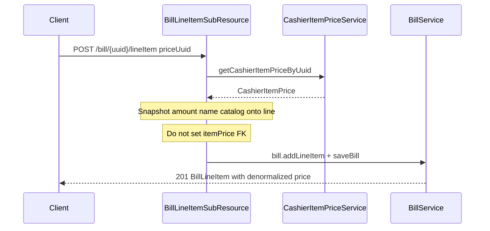

# Bill line items via priceUuid (create-time snapshot)

**Overview:** Add `POST /bill/{uuid}/lineItem` that appends a line from `quantity` + `priceUuid`, snapshotting price/name/catalog at create time (no live CashierItemPrice dependency). Nested bill create uses the same snapshot rule instead of a client-supplied numeric `price`.

## Todos

- [x] Add helper that snapshots CashierItemPrice onto BillLineItem at create (no itemPrice FK)
- [x] Fix BillLineItemResource priceUuid as write-only create input; snapshot fields; drop raw price from creatable
- [x] Add POST /bill/{uuid}/lineItem controller with quantity + priceUuid
- [x] Tests for snapshot-on-create, append, and create-via-priceUuid; catalog price change does not affect line
- [x] Update docs/rest-api.md create sections (priceUuid write-only; denormalized price)

## Problem

Frontend today does:

```js
await updateBill(currentBill.uuid, {
  lineItems: [...initialLineItems, ...newLineItems],
});
```

[`BillResource.setBillLineItems`](../omod/src/main/java/org/openmrs/module/billing/web/rest/resource/BillResource.java) uses `syncCollection`, so omitted lines are removed and existing lines are re-copied. That is the wrong API for “add one line.”

Also [`BillLineItemResource.setItemPrice`](../omod/src/main/java/org/openmrs/module/billing/web/rest/resource/BillLineItemResource.java) is a stub (`CashierItemPrice itemPrice = null`) and the getter always returns `""`.

## Design rule: snapshot, do not live-link

Bill line items stay **immutable** after creation. `priceUuid` is only a **create-time lookup** into `CashierItemPrice`:

- Resolve the price row once
- Copy `price` amount, `priceName`, and catalog owner (`billableService` / `billableDrug` / `item`) onto the `BillLineItem`
- **Do not set / do not rely on** `BillLineItem.itemPrice` for REST creates — later catalog price edits must not change billed lines
- After create, the denormalized `BillLineItem.price` / `priceName` are the source of truth (enforced by existing immutability interceptor)

`priceUuid` is **write-only** on create. Responses expose the snapped `price`, `priceName`, and catalog refs — not a live price link.

### CashierItemPrice covers services and drugs

One append/create path for all catalog types. `CashierItemPrice` already has exactly one of:

- `billableService` — service prices (`servicePrices`)
- `billableDrug` — drug prices (`drugPrices`)
- `item` — legacy StockItem

The snapshot helper copies whichever owner is non-null onto the line item. No separate service vs drug line-item endpoints.

## API contract

**Append (new):**

```http
POST /ws/rest/v1/billing/bill/{billUuid}/lineItem
```

```json
{ "quantity": 1, "priceUuid": "<cashier-item-price-uuid>" }
```

Optional: `status`, `lineItemOrder`, `batchNumber`.

**Bill create / nested lineItems:**

```json
{
  "patient": "...",
  "lineItems": [
    { "quantity": 1, "priceUuid": "<cashier-item-price-uuid>" }
  ]
}
```

Numeric `price` is **not** creatable via REST. Clients send `priceUuid`; the server snapshots amount and name at create time.



## Implementation

### 1. Shared snapshot helper

Helper given `CashierItemPrice` + quantity populates a `BillLineItem`:

- `setPrice(price.getPrice())` — snapshotted amount
- `setPriceName(price.getName())`
- set `billableService` / `billableDrug` / `item` from whichever non-null owner is on the price
- **do not** call `setItemPrice(...)` on REST create paths
- throw if price missing/retired or has no catalog owner

Reuse from append endpoint and nested bill create.

### 2. Fix `priceUuid` on [`BillLineItemResource`](../omod/src/main/java/org/openmrs/module/billing/web/rest/resource/BillLineItemResource.java)

- Setter: load via `CashierItemPriceService.getCashierItemPriceByUuid`, snapshot fields as above
- Getter: return empty / omit — `priceUuid` is not a persisted live link (representation already has `price` / `priceName`)
- Creatable: `quantity` + `priceUuid`; optional `status`, `lineItemOrder`, `batchNumber`
- Remove numeric `price` and client-supplied catalog UUIDs from creatable props
- Representation still exposes denormalized `price`, `priceName`, catalog refs as read-only

### 3. New sub-resource under Bill (mirror Payment)

Add append resource at path `lineItem` under [`BillResource`](../omod/src/main/java/org/openmrs/module/billing/web/rest/resource/BillResource.java), modeled on [`PaymentResource`](../omod/src/main/java/org/openmrs/module/billing/web/rest/resource/PaymentResource.java):

- Creatable: `quantity`, `priceUuid` (+ optional `status`, `lineItemOrder`, `batchNumber`)
- `save`: reject if `!bill.acceptsNewLineItems()`; snapshot from price; `bill.addLineItem(line)`; `BillService.saveBill(bill)`
- `doGetAll` / void: same patterns as payment / current line-item void

**Converter conflict:** Prefer SubResource; if dual registration with standalone [`BillLineItemResource`](../omod/src/main/java/org/openmrs/module/billing/web/rest/resource/BillLineItemResource.java) fails, use a thin custom controller with the same path/payload.

**Implemented as:** custom controller [`BillLineItemAppendController`](../omod/src/main/java/org/openmrs/module/billing/web/rest/controller/BillLineItemAppendController.java) at `POST /bill/{billUuid}/lineItem` (avoids a second REST converter for `BillLineItem`).

Default `lineItemOrder` when omitted: `max(existing orders) + 1`. Default `status`: `PENDING`.

### 4. Validation / immutability

- [`Bill.acceptsNewLineItems()`](../api/src/main/java/org/openmrs/module/billing/api/model/Bill.java) — PENDING/POSTED (or new)
- [`BillValidator`](../api/src/main/java/org/openmrs/module/billing/validator/BillValidator.java) on save
- [`ImmutableBillLineItemInterceptor`](../api/src/main/java/org/openmrs/module/billing/api/db/hibernate/ImmutableBillLineItemInterceptor.java) unchanged — append only inserts new rows; existing lines keep frozen amounts

### 5. Tests

- Snapshot: create from `priceUuid` copies amount/name/catalog; `itemPrice` remains null on REST-created lines
- After create, changing/retiring the `CashierItemPrice` does not change the saved line’s `price`
- Append to PENDING bill does not rewrite existing line IDs
- Append to non-accepting bill fails
- Nested bill create with `{ quantity, priceUuid }` succeeds; raw `price` alone is rejected

### 6. Docs

Update [`docs/rest-api.md`](./rest-api.md):

- `POST /bill/{uuid}/lineItem` with `quantity` + `priceUuid`
- Nested create uses `priceUuid`; amount is snapshotted at create
- Explicit note: line items do not live-link to catalog prices; catalog changes do not rewrite bills

## Out of scope

- Frontend `updateBill` call site changes (consumer app)
- Migrating order-billing strategies off `setItemPrice` (they can keep the FK for now; REST paths follow snapshot-only)
- Dropping the `price_id` column / `itemPrice` mapping from the schema
- Retiring standalone `/billLineItem` unless SubResource conversion forces it
