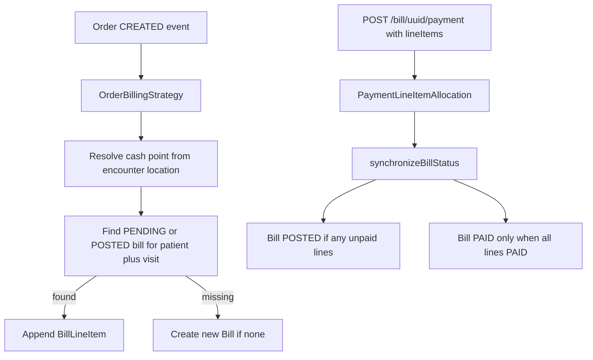

# Location-aware billing, BillableDrug catalog, payments, consolidation, and AMPATH publish

## Decisions (locked)

- **Scoping:** Facility/location only via cash point + encounter location (no tenant ID). `BillableService` and `BillableDrug` are location-scoped.
- **Drug price management:** New **`BillableDrug`** catalog modeled after **`BillableService`** (same patterns for status, location, and **`CashierItemPrice` bag** — multiple prices already supported via payment mode / nested prices). Keyed by OpenMRS **`Drug` UUID**. Managed via **REST only** (no Initializer for BillableDrug/drug prices).
- **Batch (inventory sync):** Optional **`batchNumber` on `BillLineItem`** for drug lines only — supplied by the frontend (Odoo dropdown), persisted so inventory sync knows which batch to update. **Not** a price dimension on `CashierItemPrice`.
- **Stock compatibility:** Keep existing `StockItem` coupling for **backward compatibility**. Prefer `BillableDrug`; fall back to StockItem when none exists.
- **Payments:** REST allocates payment to specific line items; bill stays `POSTED` until **all** payable line items are `PAID`.
- **Orders:** Same patient + visit → one open bill (append line items).
- **Publish:** Deploy to GitHub Packages at `https://maven.pkg.github.com/AMPATH/openmrs-content-amrs`.

---

## 0. BillableDrug (modeled after BillableService) + batch on line item

Today services use [`BillableService`](api/src/main/java/org/openmrs/module/billing/api/model/BillableService.java) with a `servicePrices` bag of [`CashierItemPrice`](api/src/main/java/org/openmrs/module/billing/api/model/CashierItemPrice.java) (already supports multiple prices, e.g. by payment mode). Drugs lack an equivalent catalog.

### BillableDrug = BillableService for drugs

Mirror the service model as closely as possible:

| BillableService | BillableDrug |
|-----------------|--------------|
| `concept` | `drug` (`org.openmrs.Drug` — formulation UUID) |
| `serviceType` / `serviceCategory` | omit or optional metadata if needed later |
| `location` (new, this plan) | `location` (same) |
| `serviceStatus` | `status` (ENABLED/DISABLED) |
| `servicePrices` → `CashierItemPrice` | `drugPrices` → `CashierItemPrice` |
| REST `/billableService` | REST `/billableDrug` |
| Initializer CSV | **No Initializer** — create via REST |

**Pricing:** Reuse existing `CashierItemPrice` behavior (multiple rows per BillableDrug, optional `paymentMode`). Add nullable `billable_drug_id` on `cashier_item_price` alongside `service_id` / stock `item_id`. XOR: exactly one owner. **Do not** add batch to `CashierItemPrice`.

**Price resolution for orders:** same pattern as services today — first / appropriate `CashierItemPrice` for the BillableDrug (payment mode when known). No batch-based price lookup.

### Batch number on BillLineItem (inventory sync, not pricing)

- Add optional `batchNumber` (`String`) on [`BillLineItem`](api/src/main/java/org/openmrs/module/billing/api/model/BillLineItem.java) (+ Liquibase/HBM).
- Used for **drug** lines so downstream inventory sync (Odoo) knows which batch to decrement/update.
- **Source:** frontend dropdown populated from Odoo; passed when creating/updating the bill line (REST creatable/updatable property on line item / bill payload).
- Auto-order billing may leave `batchNumber` null until a cashier/dispense UI sets it on the line.
- Expose on REST representations for bill line items.

### Schema / HBM

- Table `cashier_billable_drug` (parallel columns to billable service where applicable).
- `cashier_item_price.billable_drug_id` (nullable FK).
- `cashier_bill_line_item.billable_drug_id` (nullable FK) + `batch_number` (nullable string).

### Order billing ([`DrugOrderBillingStrategy`](api/src/main/java/org/openmrs/module/billing/api/billing/impl/DrugOrderBillingStrategy.java))

1. Resolve `Drug` from order → enabled `BillableDrug` by drug UUID + location (fallback global).
2. Price from BillableDrug’s `CashierItemPrice` bag (same approach as TestOrder → BillableService).
3. Set `lineItem.setBillableDrug(...)`; leave `batchNumber` unset unless provided by a later update.
4. Else StockItem fallback (backward compat).
5. Never price drugs via concept → `BillableService`.

### Stock coupling kept

- Keep stockmanagement require, StockItem fields, legacy REST `item`, rounding StockItem.

---

## 1. Facility / location scoping

**Cash point resolution** — shared in [`AbstractDefaultOrderBillingStrategy`](api/src/main/java/org/openmrs/module/billing/api/billing/impl/AbstractDefaultOrderBillingStrategy.java):

1. Encounter location → cash points by location
2. Else session location
3. Else first non-retired cash point

Change [`resolveCashPoint()`](api/src/main/java/org/openmrs/module/billing/api/billing/OrderBillingStrategy.java) to take `Order`.

**Bill search:** `locationUuid` on [`BillSearch`](api/src/main/java/org/openmrs/module/billing/api/search/BillSearch.java) via `bill.cashPoint.location`; REST on [`BillResource`](omod/src/main/java/org/openmrs/module/billing/web/rest/resource/BillResource.java).

**BillableService + BillableDrug location:** optional `Location` on both; search prefer location-specific then global (`location = null`).

---

## 2. Other order types

- [`ConceptOrderBillingStrategy`](api/src/main/java/org/openmrs/module/billing/api/billing/impl/): non-drug/non-test orders → location-scoped `BillableService`.
- Orderextension: no hard dependency; `DrugOrder` members use BillableDrug (then StockItem fallback).

---

## 3. Line-item payments without closing the bill early

**Schema:** `cashier_bill_payment_line_item` (`payment_id`, `bill_line_item_id`, `amount`, audit).

**Model:** `PaymentLineItemAllocation` on `Payment`.

**[`Bill.synchronizeBillStatus()`](api/src/main/java/org/openmrs/module/billing/api/model/Bill.java):**

- With allocations: line `PAID` when allocated ≥ line total; bill `PAID` only when all payable lines are `PAID`; else `POSTED`.
- Without allocations: keep current bill-level behavior.
- Re-sync on payment void/remove.

**REST [`PaymentResource`](omod/src/main/java/org/openmrs/module/billing/web/rest/resource/PaymentResource.java):** `lineItems: [{ uuid, amount }]`.

**Immutability:** Allow new line items on `POSTED` bills (consolidation) and payment allocations.

---

## 4. Visit-level bill consolidation

In [`AbstractDefaultOrderBillingStrategy.createBill()`](api/src/main/java/org/openmrs/module/billing/api/billing/impl/AbstractDefaultOrderBillingStrategy.java): find PENDING/POSTED bill for patient+visit (prefer PENDING, same cash point when possible); append line item; else create new. Keep order-UUID idempotency.

---

## 5. Publish to AMPATH GitHub Packages

Maven profile `github-packages` → `https://maven.pkg.github.com/AMPATH/openmrs-content-amrs` (`O3-amrs`). Keep OpenMRS mavenrepo as default. New [`.github/workflows/publish-github-packages.yml`](.github/workflows/publish-github-packages.yml).

---

## Test plan

- BillableDrug CRUD + nested/multi `CashierItemPrice` (same patterns as BillableService).
- Drug order → BillableDrug line; StockItem fallback when no BillableDrug.
- Set/update `batchNumber` on drug BillLineItem via REST; present in representations (for Odoo sync consumers).
- BillableService location filter.
- Two orders same visit → one bill.
- Pay one line → line PAID, bill POSTED; pay rest → bill PAID.
- Publish workflow YAML valid.

## Out of scope

- Initializer / content-package CSV for BillableDrug or drug prices.
- Batch-based price selection on `CashierItemPrice`.
- Fetching batches from Odoo in this module (frontend responsibility; billing only stores `batchNumber`).
- Removing stockmanagement dependency or StockItem fields.
- True multi-tenant row isolation.
- Hard dependency on `openmrs-module-orderextension`.
- Auto-PR into content-amrs `content.properties`.
